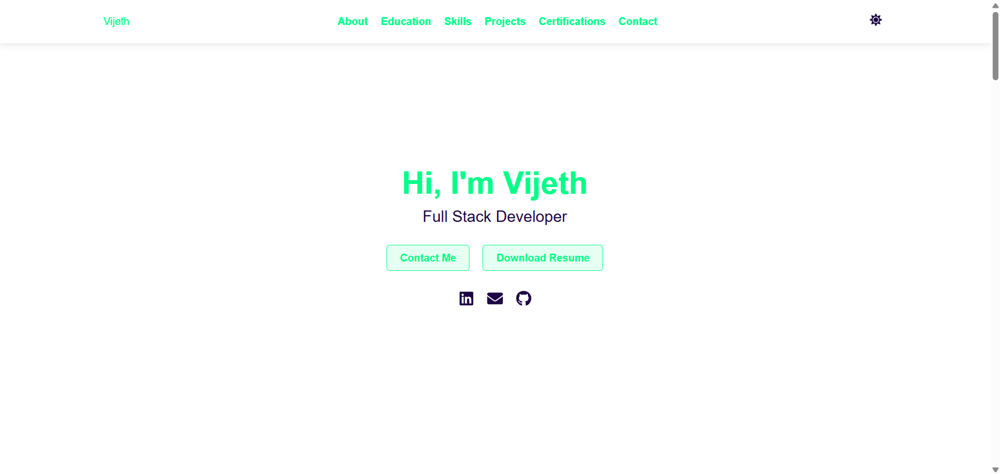
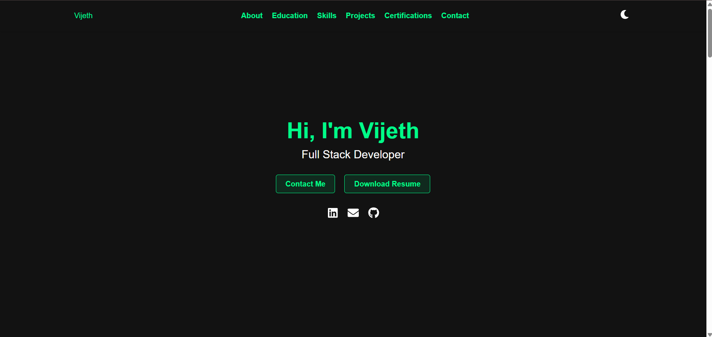

# 🌟 **React Portfolio**

**A Modern Developer Portfolio Built with React**

Welcome to my **React Portfolio**! This project showcases my skills, projects, and certifications in a clean, responsive, and interactive web application. Built with **React.js**, this portfolio is designed to highlight my work as a developer while providing a seamless user experience.

---

## 🚀 **Features**

- **Responsive Design**: Optimized for all devices (desktop, tablet, mobile).
- **Dark/Light Theme**: Toggle between themes for better user experience.
- **Interactive Components**: Smooth hover effects and animations.
- **Project Showcase**: Display projects with live demos and GitHub links.
- **Skills Section**: Categorized tech stacks with icons.
- **Contact Form**: Integrated with **EmailJS** for direct communication.

---

## 🛠️ **Technologies Used**

- **Frontend**: React.js, JavaScript (ES6+), HTML5, CSS3
- **APIs**: EmailJS (for contact form submissions)
- **Icons**: React Icons (Font Awesome, Material Icons)
- **Tools**: Git, GitHub, npm, Webpack (for bundling)

---

## 🎨 **Design Highlights**

- **Clean UI**: Minimalistic and modern design.
- **Dynamic Theme**: Switch between dark and light modes.
- **Interactive Elements**: Buttons, cards, and links with hover effects.
- **Responsive Layout**: Flexbox and CSS Grid for seamless responsiveness.

---

## 📂 **Project Structure**

```
react-portfolio/
├── public/               # Static assets
├── src/
│   ├── components/       # Reusable components
│   ├── data/             # Project and skills data
│   ├── styles/           # CSS files
│   ├── App.js            # Main application component
│   └── index.js          # Entry point
├── package.json          # Project dependencies
└── README.md             # Project documentation
```

---

## 🖥️ **Live Demo**

Check out the live version of the portfolio:
👉 **[Live Demo](https://vijeth-shetty.github.io/Vijeth-React-Port-Folio/)**

---

## 🛠️ **How to Run Locally**

### **Prerequisites**

- Node.js (v16 or higher)
- npm (v8 or higher)

### **Steps to Run**

1. **Clone the Repository**

   ```bash
   git clone https://github.com/your-username/react-portfolio.git
   cd react-portfolio
   ```
2. **Install Dependencies**

   ```bash
   npm install
   ```
3. **Set Up EmailJS**

   - Create an account on [EmailJS](https://www.emailjs.com/).
   - Replace the following placeholders in the `Contact.jsx` file:
     - `YOUR_SERVICE_ID`
     - `YOUR_TEMPLATE_ID`
     - `YOUR_PUBLIC_KEY`
4. **Run the Application**

   ```bash
   npm start
   ```

   The app will open at `http://localhost:3000`.
5. **Build for Production**

   ```bash
   npm run build
   ```

---

## 📸 **Screenshots**


| **Light Theme**                             | **Dark Theme**                            |
| --------------------------------------------- | ------------------------------------------- |
|  |  |

---

## 📝 **Customization**

- Update project data in `src/data/projects.js`.
- Add or modify skills in `src/data/skills.js`.
- Replace the profile image in `public/Resources/Photos/`.
- Update the contact form configuration in `src/components/Contact/Contact.jsx`.

---

## 🤝 **Contributing**

Contributions are welcome! If you'd like to improve this project, follow these steps:

1. Fork the repository.
2. Create a new branch (`git checkout -b feature/YourFeatureName`).
3. Commit your changes (`git commit -m 'Add some feature'`).
4. Push to the branch (`git push origin feature/YourFeatureName`).
5. Open a pull request.

## 🙏 **Acknowledgments**

- [React Icons](https://react-icons.github.io/react-icons/) for providing scalable icons.
- [EmailJS](https://www.emailjs.com/) for seamless email integration.
- [GitHub Pages](https://pages.github.com/) for hosting the live demo.

---

## 📧 **Contact**

Have questions or suggestions? Feel free to reach out:

- **Email**: [vijethshetty334@gmail.com](vijethshetty334@gmail.com)
- **GitHub**: [vijeth-shetty](https://github.com/vijeth-shetty)
- **LinkedIn**: [Vijeth](https://www.linkedin.com/in/vijeth-shetty-334s)
